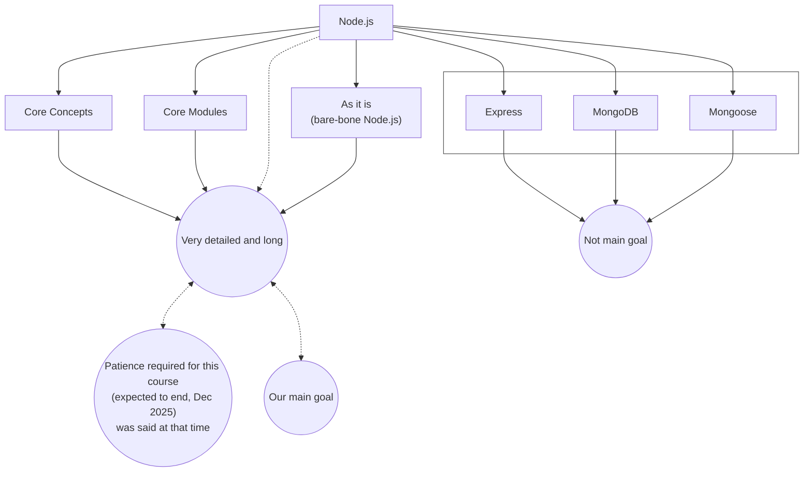

# 01 Welcome to Node.js Course

You can request a topic if you feel it is missing *(The course was ongoing at that time. So, he asked that time)*.

- Someone asked for **WebSockets**.
- Sir also added **WebHooks**.
- Comment below for the topics to add.

### Be active in the community:
- **Help others**
- **Ask/Solve doubts**
- You can also ask doubts in the **Q&A section**.
- Helping others also helps **strengthen our own understanding**.

### To enable shortcuts on the Platform

- **Procodrr Extension** ✓ Why?
    - Video in the description
    - Also mentioned in the community post

- Comment for any **missing resources**.
- For any help: `contact@procodrr.com`
