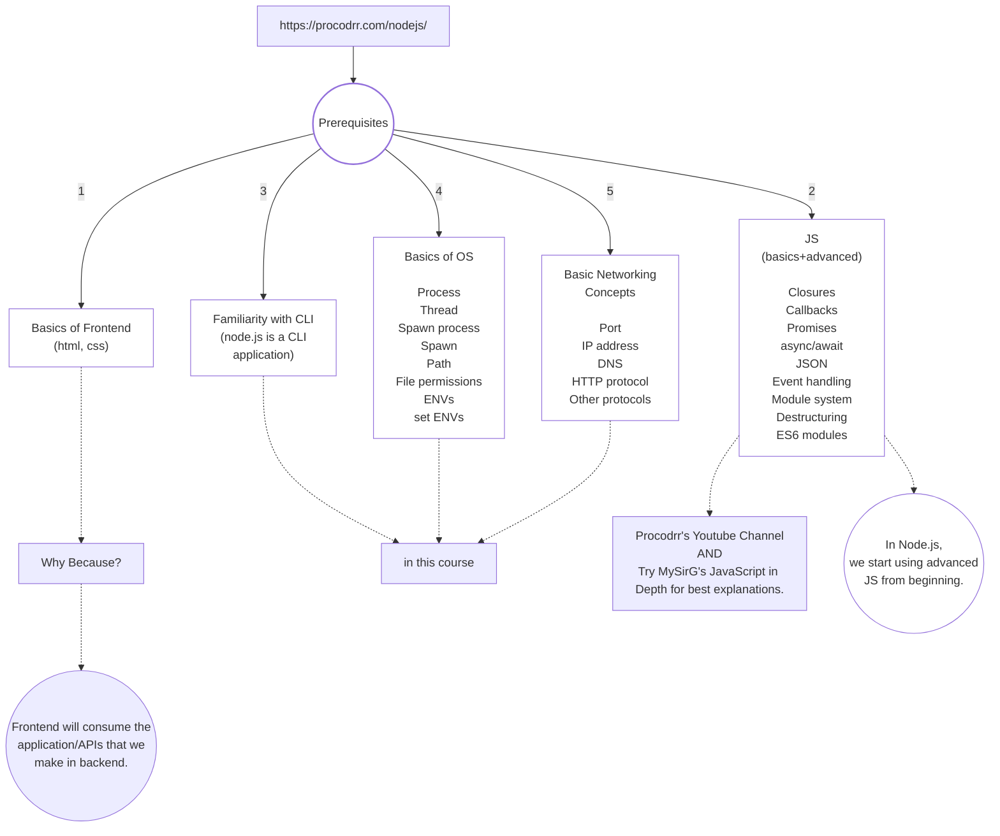

# Prerequisites

```mermaid
flowchart TD
    C["https://procodrr.com/nodejs/"]

    P(("Prerequisites"))
    C --> P

    P --> |1| FE["Basics of Frontend<br/>(html, css)"]

    P --> |3| CLI["Familiarity with CLI<br/>(node.js is a CLI<br/>application)"]

    P --> |4| OS["Basics of OS<br/><br/>Process<br/>Thread<br/>Spawn process<br/>Spawn<br/>Path<br/>File permissions<br/>ENVs<br/>set ENVs"]

    P --> |5| NET["Basic Networking<br/>Concepts<br/><br/>Port<br/>IP address<br/>DNS<br/>HTTP protocol<br/>Other protocols"]

    CLI -.-> X["in this course"]
    OS -.-> X
    NET -.-> X

    P --> |2| JS["JS<br/>(basics+advanced)<br/><br/>Closures<br/>Callbacks<br/>Promises<br/>async/await<br/>JSON<br/>Event handling<br/>Module system<br/>Destructuring<br/>ES6 modules"]

    JS -.-> Y["Procodrr's Youtube Channel\nAND\nTry MySirG's JavaScript in Depth for best explanations."]

    FE -.-> B["Why Because?"]
    BACK(("Frontend will consume the<br/>application/APIs that we<br/>make in backend."))
    B -.-> BACK

    JS -.-> NOTE(("In Node.js,<br/>we start using advanced<br/>JS from beginning."))

    style P fill:none,stroke-width:2px
    style FE fill:none,stroke-width:1px
    style CLI fill:none,stroke-width:1px
    style OS fill:none,stroke-width:1px
    style NET fill:none,stroke-width:1px
    style JS fill:none,stroke-width:1px

    style NOTE fill:none,stroke-width:1px
```