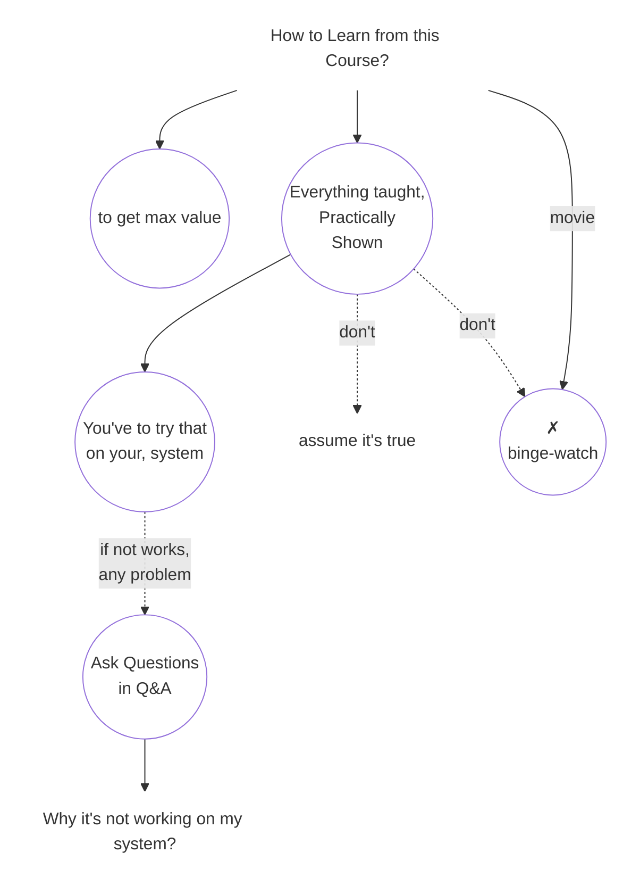

## 🎬 Learn It. Then Experience It.

> **If you know a concept very well, you can watch that concept like a movie.**
>
> **But if the concept is new, you will have to practice it.**

## Try 
to get the **same output on your own system** using the same code demonstrated in the lecture.

## Replicate anything practical
* Change the setting.
* or anything else.

> **The above is the bare minimum.**

### 🔎 Explore Yourself
* Talk with **ChatGPT** to understand concepts from different perspectives, clarify doubts
* and discover things that weren't covered in the lecture.

---

> ### **Keep your Curiosity Alive.**
>
> ### **Go Beyond.**