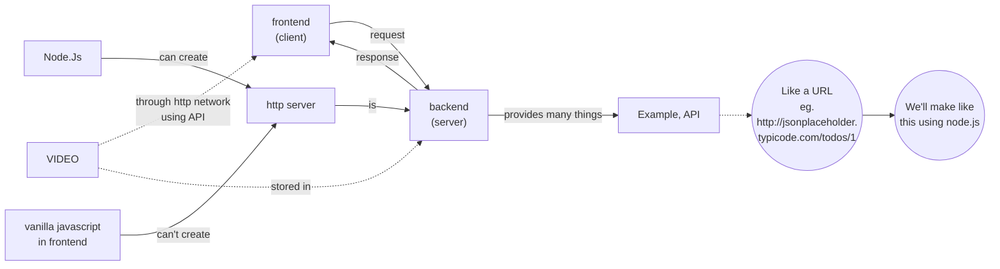
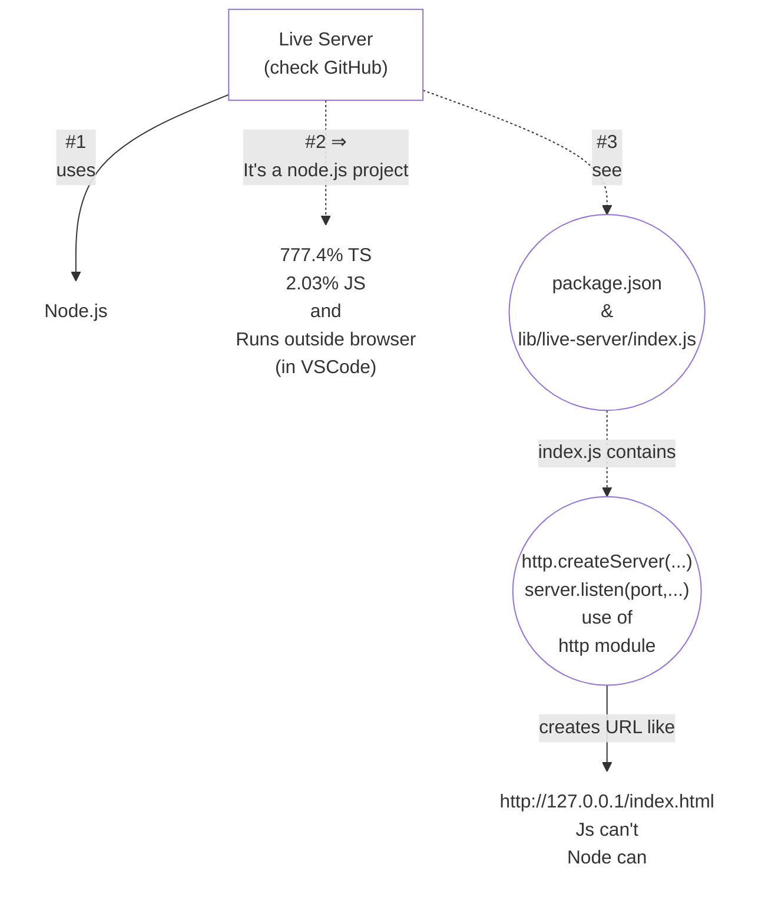

# What is **Backend?**
We see frontend on UI. But, the video comes from backend (for example and just one example, there are more).

> While learning frontend we use **nodejs**, to create a server (unknowingly).

> similarly, react uses node.js
> react uses http.createServer() under the hood, to start a server.
> means, there should be a backend to run a frontend application too.
> but that would be a simple server that only serves files.