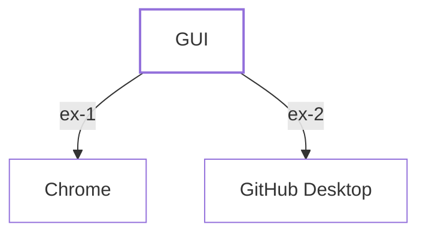
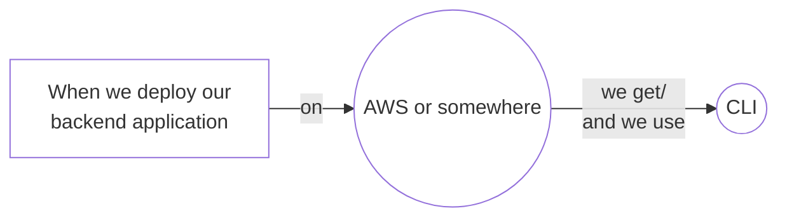

# CLI-vs-GUI

  <strong style="font-size: 32px">vs</strong>

```mermaid
flowchart TD

CLI["CLI"]

CLI --> |"can't only<br/>be an"| APP["Application"]

CLI --> |"can be<br/>an"| OS["OS<br/>(e.g. MS-DOS, UNIX)"]

CLI --> TERMINAL["Terminal\n(Windows PowerShell)"]

CLI --> GIT["Git"]

CLI --> NPM["npm"]

CLI --> YTDLP["yt-dlp\n(check GitHub)"]

YTDLP --> C["Very customizable<br/>(powerful)"]

subgraph D[" "]
    direction LR

    R["reverse order download"]
    V["start from video number 100"]
    S["Save files<br/>in order by automate<br/>renaming"]
end

C --> R
C --> V
C --> S

E(("many such features"))
E -.-> D

YTDLP -.-> P["made in Python"]

YTDLP --> N["We can also<br/>make such<br/>thing using<br/>Node.js"]

YTDLP --> I(("install<br/>after learning<br/>PATH system<br/>in OS"))

style YTDLP fill:none,stroke-width:2px
style C fill:none,stroke-width:1px
style R fill:#2a2a2a,stroke:#168dcc
style V fill:#2a2a2a,stroke:#168dcc
style S fill:#2a2a2a,stroke:#168dcc
style P fill:none,stroke-width:1px
style N fill:none,stroke-width:1px
style I fill:none,stroke-width:1px

style CLI fill:none,stroke-width:2px

style APP fill:none,stroke-width:1px
style OS fill:none,stroke-width:1px
style TERMINAL fill:none,stroke-width:1px
style GIT fill:none,stroke-width:1px
style NPM fill:none,stroke-width:1px
style YTDLP fill:none,stroke-width:1px
```

> Mac and Linux are built on UNIX.  
> Core UNIX was purely CLI.  
> We'll see some of UNIX concepts, like: **UNIX** vs **Windows PATH system**.

**Node.js** is a command line application.