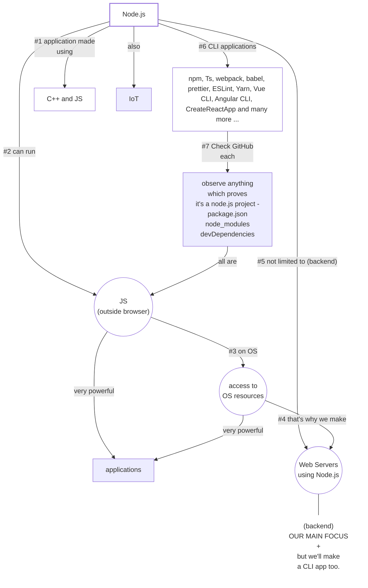

# What is Node.js? | What is it used for?
> Js in browser has very limited access.  
> **Node.js** runs on OS.  
> has access to OS resources.  
> very powerful applications.

> npm, Ts, webpack  
> babel, prettier, ESLint   
> Yarn, Vue CLI, Angular CLI  
> CreateReactApp, _and many more ..._  
- _Check GitHub of each_  
- _package.json (and other things that prove it's a nodejs project or npm project)_

## TypeScript
- 98% **TypeScript** is made in Typescript.
- **TypeScript** originally made using **JavaScript**.
- Later, **TypeScript** evolved and it's support become available in many IDE's.
- They, used their **JavaScript** code (which was the **TypeScript** Language), in **TypeScript** itself.
- Because, **JavaScript** code works in **TypeScript**.

- but, at the end, we know everything translates back to ****JavaScript****.
- because, neither **Node.js** nor the **browser** understands ****TypeScript****.