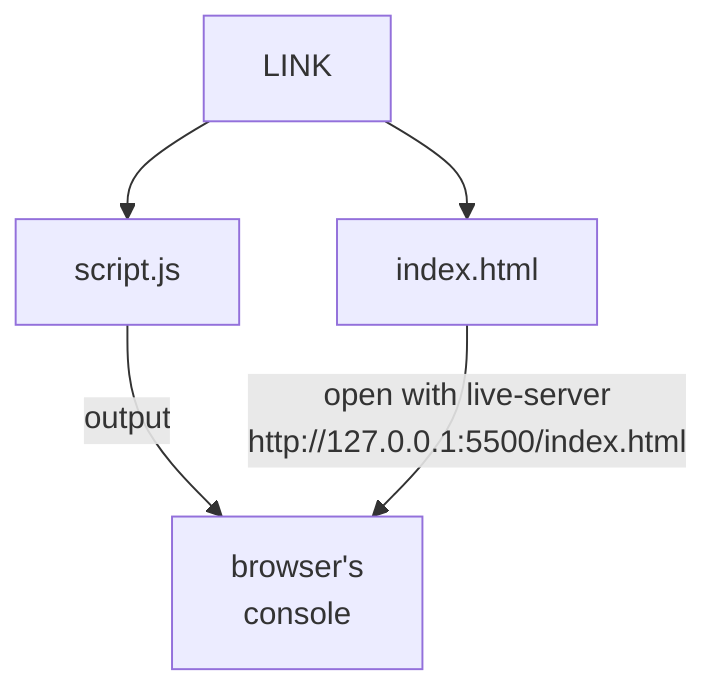
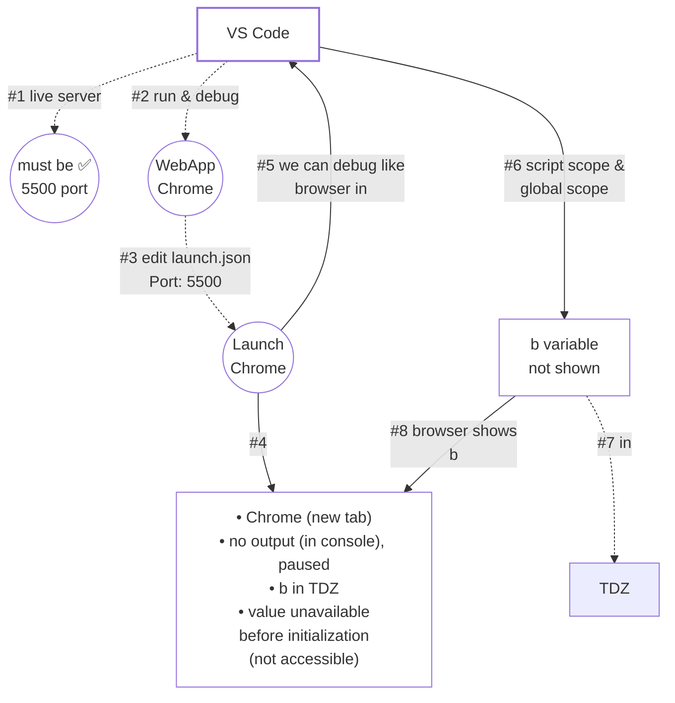
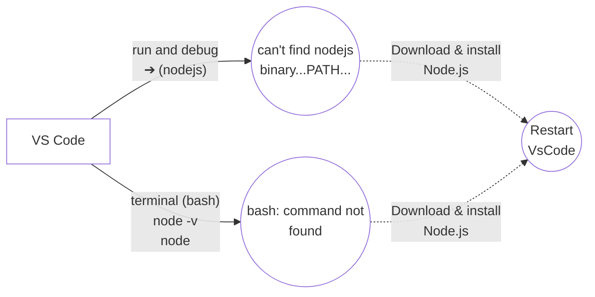
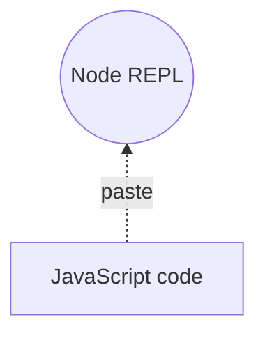
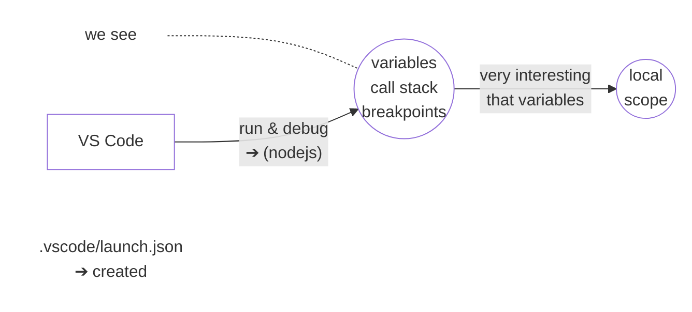

# Installing Node.js
- download & install VsCode  

    

        <strong>index.js</strong>
    

    <pre style="display: inline-block; text-align: left; padding: 12px 20px;">let a = 5;
let b = 4;
console.log(a + b);</pre>

- _127.0.0.1 is localhost_

- _before 2008 (Node.js), there was no other way to run Js outside Browser._

    

        <strong>index.js</strong>
    

    <pre style="display: inline-block; text-align: left; padding: 12px 20px;">&nbsp; let a = 5;
*&nbsp;let b = 4;
&nbsp; console.log(a + b);</pre>

- _notice, the index.js has breakpoint on "let b = 4;"_

- _#2 run & debug creates .vscode/launch.json_  
- _forward the code (f9) like you do while debugging_  
- _and, **b** will become visible, after initialization_  
- _**b** comes out of **Temporal Dead Zone** (TDZ)._  

> add a line console.log(document), to see document object in (VsCode)  
> add breakpoint, somewhere  
> hover on '**document**' to see it's contents  
> '**document**' object is provided by **WebAPI**  
> use defer attribute to see body content in **document** object  

`delete html file` 
and 
`.vscode/launch.json`

- **VS Code**
  - **Terminal**
    - `node -v`
    - `node`
      - `> 5 + 6`   
      - `> document`  
        `❌`
      - `> window`  
        `❌`

- _the above prompt '>' is provided by node.js application_  
- _it's called Node REPL_  
- _it can run Js code_  
- _**document** and **window** objects are not available_  
- `browser's console has document and window`  
- because they are provided by WebAPI  
- we'll see the global variables in node.js (next lecture)
- alternatives or similar to document and window

> node script.js  
    `❌` _(because of 'document')_  

also

> _this way does't provide debugging facility_  
> _&_  
> `without that kinda debugging facilities anyone can't learn Node.js (deeply)`

We defined variables in global scope, but they are shown in local scope.  
We'll see why?  
in the nodejs fundamentals [section-4](./04_fundamentals-of-node.js)  

## Next video
we'll execute some nodejs code  
(that was not in javascript)  

> Notice, the output in `debug console` and not in `terminal`.
