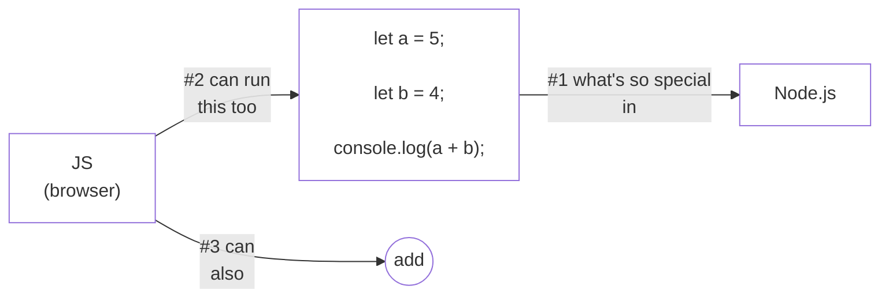
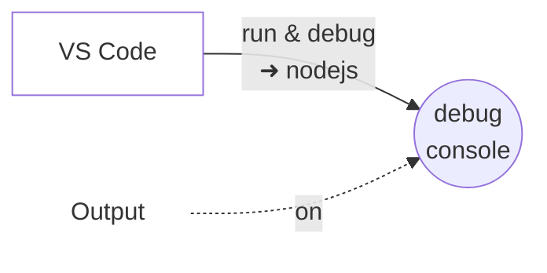
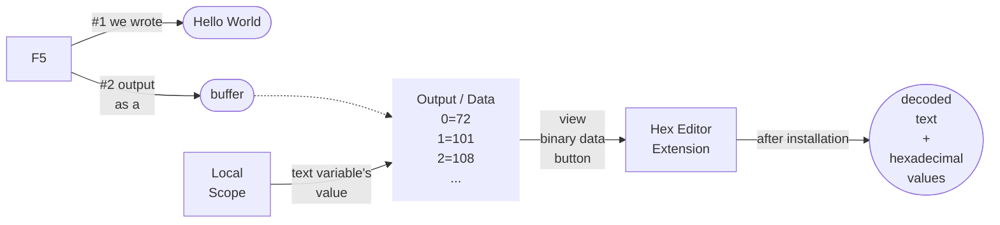
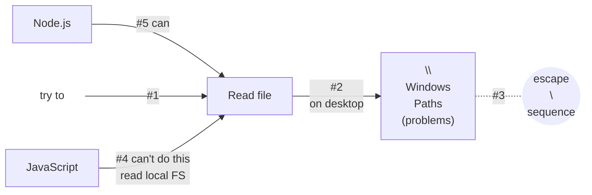
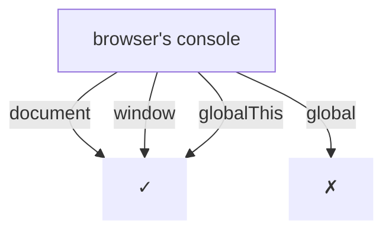

# Running our first Node.js Code

- _don't try to understand the (below) code for now_
- _we'll understand in full detail_

    

        <strong>script.js</strong>
    

    <pre style="display: inline-block; text-align: left; padding: 12px 20px;">const fs = require('fs');
const text = fs.readFileSync('./text.txt');
console.log(text);</pre>

- _notice that the output comes as a buffer_
- _we'll study **buffer** and **streams**, later in this course_

## shortcut
> create a `launch.json` file, `➜ nodejs`  
> then, you can use  
> F5 (to )  
> Ctrl + Shift + F5 (to )  
> use F5 at least for a time to run your code  

    

        <strong>script.js</strong>
    

    <pre style="display: inline-block; text-align: left; padding: 12px 20px;">const fs = require('fs');
const text = fs.readFileSync('./text.txt');
console.log(text);
console.log("End";)</pre>

- _add breakpoint on last line `console.log("End")`_
- _to see the buffer contents_
- _in **debug console**_

- _change `console.log(text)` ➜ `console.log(text.toString())` and
- _hit `ctrl + shift + F5`_
- _to see the actual string_
- _in **debug console**_

> nodejs can read, write, delete (and many things...)  
> that's a big thing.  

```mermaid
flowchart TD

    Node["Node.js"]
    Check["✓"]
    Cross["✗"]    

    subgraph G["global scope"]
        Global["global"]
    end

    Node -->|global variable here| Global

    Node --> |document| Cross

    Node -->|window| Cross

    Node --> |globalThis| Check
    Node -->|global| Check

    style G stroke:none;
    style Global fill:#333,stroke:none;
```

- _globalThis is universal_
- _works in `browser` and `nodejs` both_
- _**In browser:** globalThis ➜ window_
- _**In nodejs:** globalThis ➜ global_

