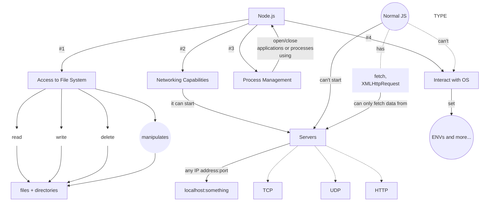
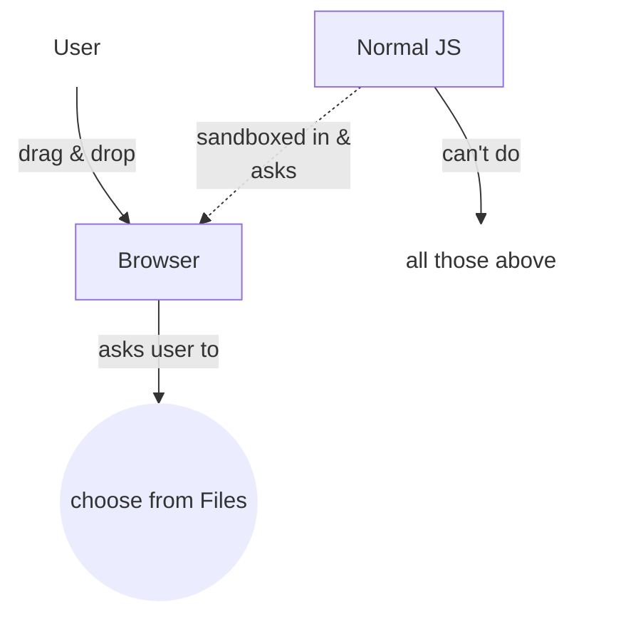
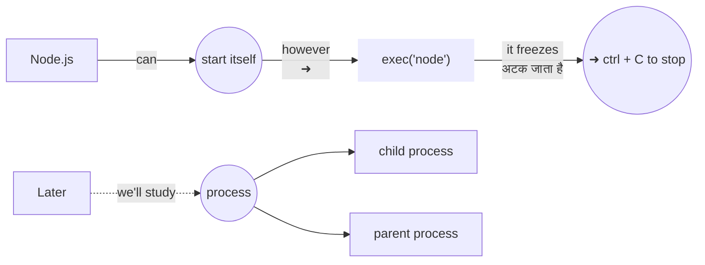
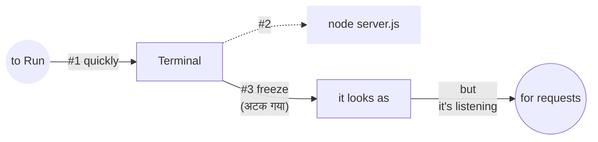
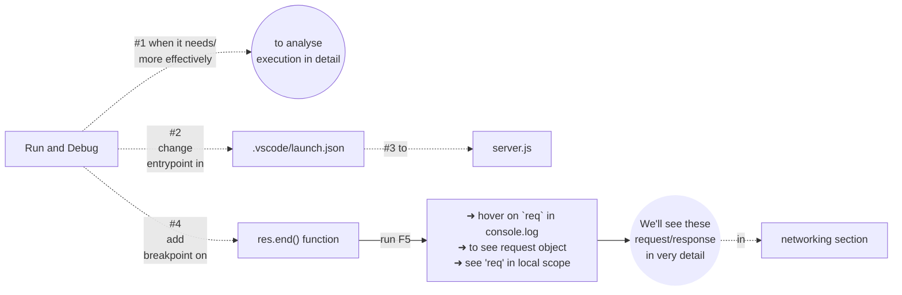

# Why do we need Node.js & How is it different from Javascript in Browser?

## ChatGPT

1. shortest code to write to a file using node.js

    

        <strong>script.js</strong>
    

    <pre style="display: inline-block; text-align: left; padding: 12px 20px;">const fs = require('fs');
fs.writeFileSync(
    'C:\\Users\\alwaysyash\\OneDrive\\Desktop\\text.txt',
    'MySirG Education Services Private Limited'
);
const text = fs.readFileSync('C:\\Users\\alwaysyash\\OneDrive\\Desktop\\text.txt');
console.log(text.toString());
console.log("End");</pre>

2. to change filename

    

        <strong>script.js</strong>
    

    <pre style="display: inline-block; text-align: left; padding: 12px 20px;">const fs = require('fs');
fs.renameSync(
    'C:\\Users\\alwaysyash\\OneDrive\\Desktop\\text.txt',
    'C:\\Users\\alwaysyash\\OneDrive\\Desktop\\hello.txt'
);
console.log("End");</pre>

3. delte file

    

        <strong>script.js</strong>
    

    <pre style="display: inline-block; text-align: left; padding: 12px 20px;">const fs = require('fs');
fs.unlinkSync('C:\\Users\\alwaysyash\\OneDrive\\Desktop\\hello.txt');
console.log("End");</pre>

4. open an application (eg. chrome)

    

        <strong>script.js</strong>
    

    <pre style="display: inline-block; text-align: left; padding: 12px 20px;">const { exec } = require('child_process');
exec('start chrome');
// exec('start firefox');
// exec('start msedge');
// exec('start code');
// exec('"C:\\Program Files\\Mozilla Firefox\\firefox.exe"');</pre>

  

- _after writing to file,_
- _navigate to the file (windows explorer/finder)_
- _try to read using `earlier code` (previous lecture)_
- _also_
- _try to view the file in `another application` eg. notepad_

> notepad (windows 11) saves file before closing  
> it can save the `earlier content`  
> if the file were already opened in it  
> so reopening can mislead  (frustating)  
> **this happened in the lecture**

- eg. _this site want's to open Whatsapp Y/N?_

- _`exec` function executes the command in terminal_
- _commands are OS specific (differs)_
- _`Mac: open -a google-chrome`_
- _we can close applications too (we'll see how to start, close in OS in more detail)_
- _and many more..._

> `unlinkSync` permanently deletes   
> **windows store apps** (some problem) | _I'will find how to open using terminal or code_  
> **other apps** ✅
> **powershell:** `start 'FullPath'`  
> **bash:** `FullPath`

> In terminal (section), we'll install `bash`  
> for now `powershell`  

## Create server using Node.js

code to create server

    

        <strong>server.js</strong>
    

    <pre style="display: inline-block; text-align: left; padding: 12px 20px;">const { http } = require('http');
const server = http.createServer((req,res) => {
    res.end('Hello from Node.js server.)
});
server.listen(3000);</pre>

> add `console.log(req)` in the **callback** function  
> run again  
> try to send `request` from browser  
> and see the request object in terminal 

### Analyse in more detail (run & debug)
