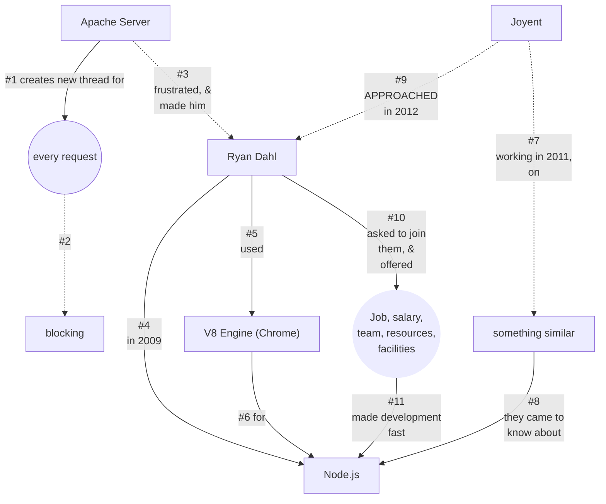
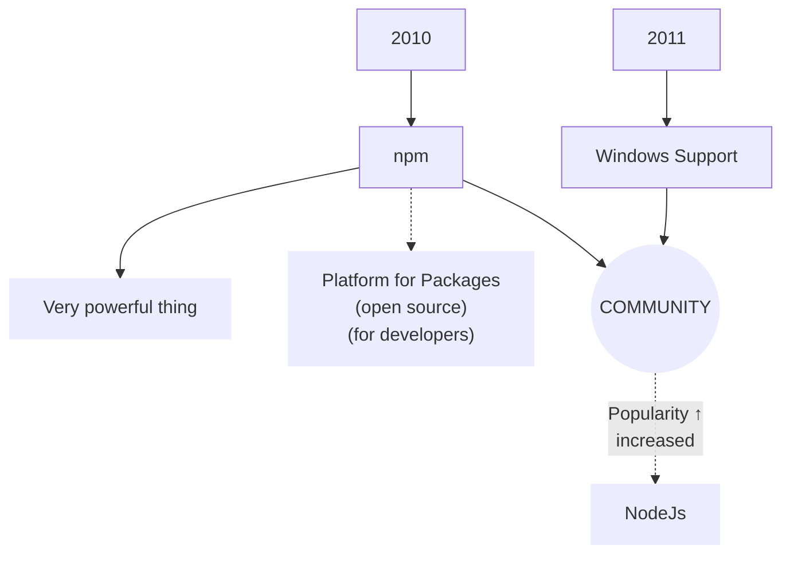
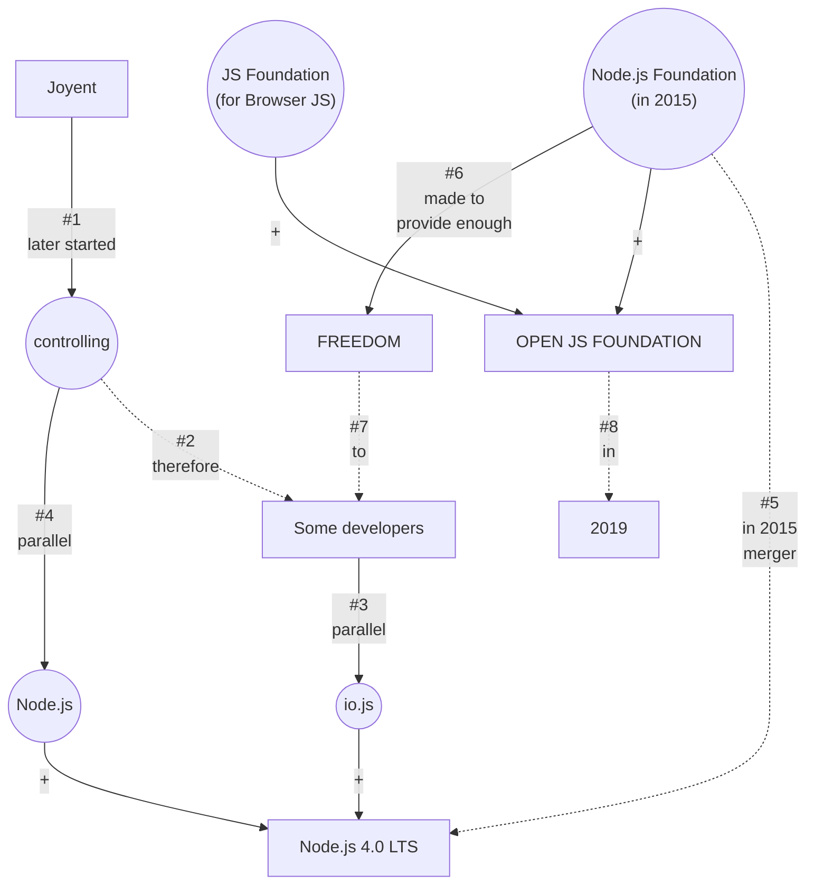

# A brief History of Node.js

- _Ryan Dahl accepted the offer from **Joyent**_
- _later_
- _the Company started controlling_
- _bound developers from adding features in Node.js_

> Atwood's Law  
> Any application that can be written in JavaScript, will eventually be written in JavaScript.  
> --Jeff Atwood, 2009.  

> The **merger** of `Node.js Foundation` and `Js Foundation` to form  
> ➜ `OpenJs Foundation` in 2019.  
> was another step toward's **Atwood's Law**.

- _because_
- _now, Javascript can be used on -_
- _a vast number of fields in software engineering._