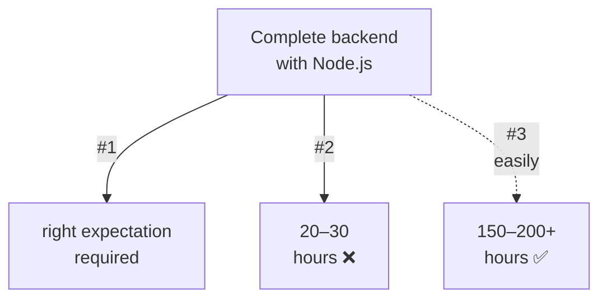
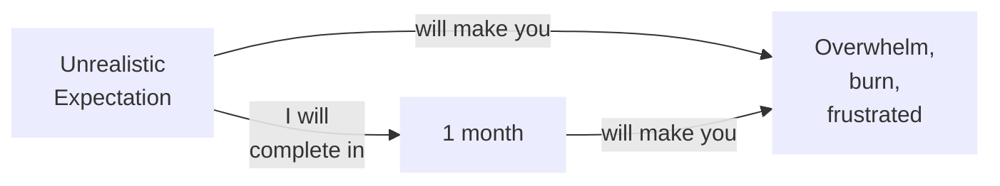
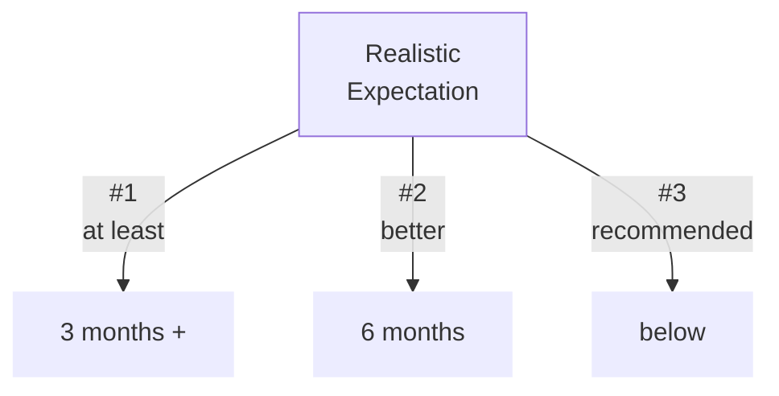

# Importance of setting Right Expectations

## Unrealistic Expectation

## Realistic Expectation

### Recommended
- Set your expectation according to the time you have, to **dedicate to the batch**.
- Assume: (if total 150 hours), then - 1 hr/day ➜ 5 months.
- that 1 hour content requires minimum 2 hours _to watch and understand_.
- `research, experimentation, exploration, practice ➜ 4 hours/day.`

- **Working Professional ➜** 1 hour/day
- **Student ➜** 2 hours/day

## Why the Batch duration (so long)?
- This batch is not like any other Node.js batch
- It's not only about Node.js
- It's about _little bit_ of `Backend`, overall
- `Software Engineering`
> Operating System  
> Networking  
> Linux fundamentals (terminal)
- _ECOSYSTEM_ (like degree/diploma)  
`Eveything we learn in this batch, will be practical.`  
`Anything, if feels theory at some point`  
`➜ that will also be shown, practically. (patience required)`  
- Do not try compare the **duration** & the **details** of this batch with some _another batch_ in market.
- **If you ever feel like:** Why so detail (in this' topic)?
- **Remember:** Everything has _purpose_ (_reason_).

### Setting Right Expectation will help to maintain interest in the journey throughout.