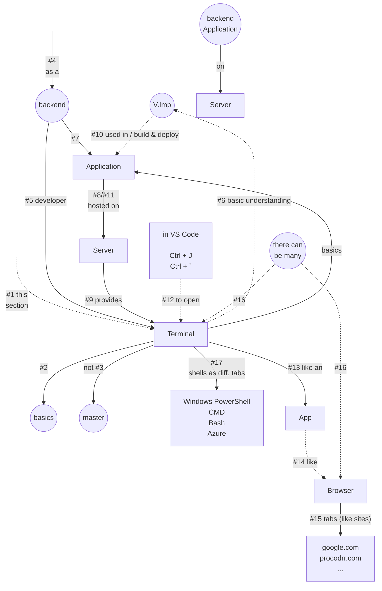
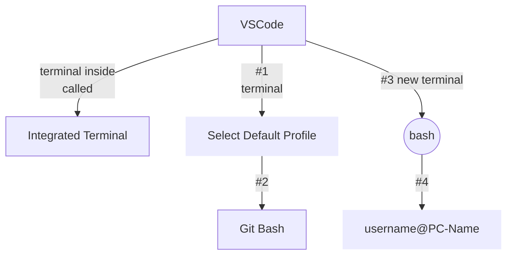
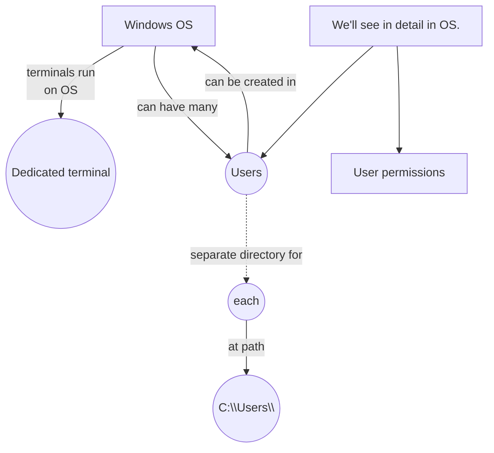

# Introduction to Terminal and Shell

**Linux:** bash  
**Mac:** zsh (default), bash  
_can be switched_

### Install `bash` on Windows
- download and install `Git`
- default editor - `vim`
- _restart VsCode_

### In VsCode (switch between terminals) -
- powershell
- command prompt
- bash
- `Javascript Debug Terminal` is powershell (not any different)

> We'll see about Users (in detail) in Operating System  
- user, user permissions  

> Integrated browser ➜ browser inside an app, _same for_ `integrated terminal`  
- `❌` Edge (by default installed), in Windows
- `✅` Chrome
- `❌` Terminal
- `✅` VsCode integrated terminal