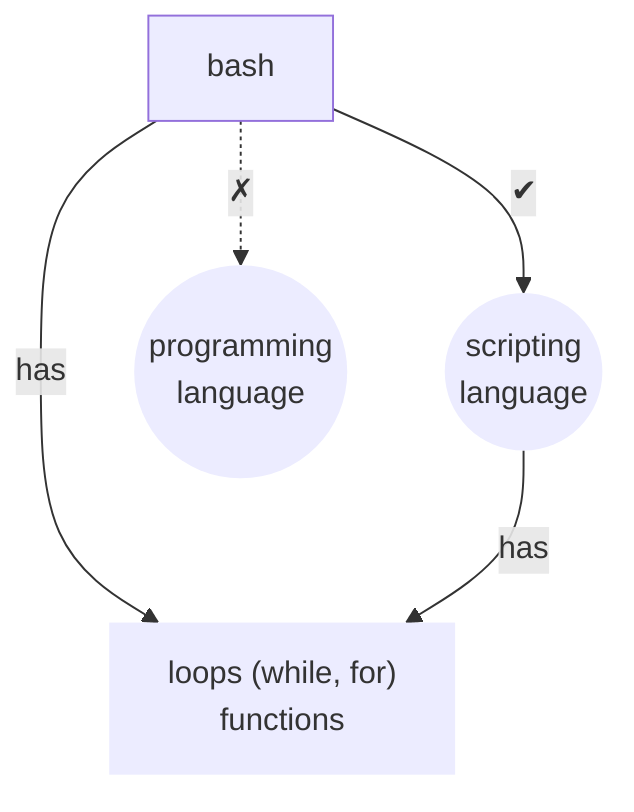

# Basic Shell Commands (echo, pwd, whoami)
- echo
- echo Yash Kushwaha
- num = 5
- echo $num
- num2 = 4
- echo $num2
- echo $((num + num2))
- pwd
- whoami

> it is possible that we store many commands (in sequence)  
> in a file  

<strong>test.sh</strong>

    <pre style="display: inline-block; text-align: left; padding: 12px 20px;">num1=5
num2=4
echo $((num1+num2))
echo End</pre>

**to execute:**
- `./test.sh`

- _like_
- _in programming language_
- _we can print_ "something" 1 time ➜ _we can print it_ any number of times
- _similarly_
- _we can execute the command to:_
- _create, delete, or anything (any number of times)_
- _after a few lectures_
- _we'll create about 1000 files_