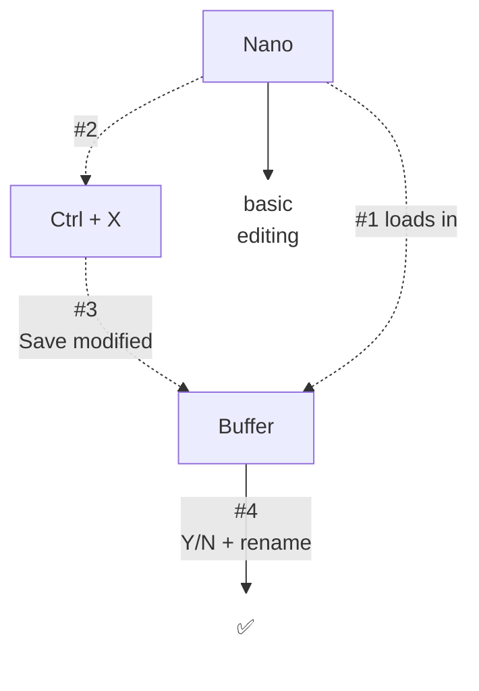
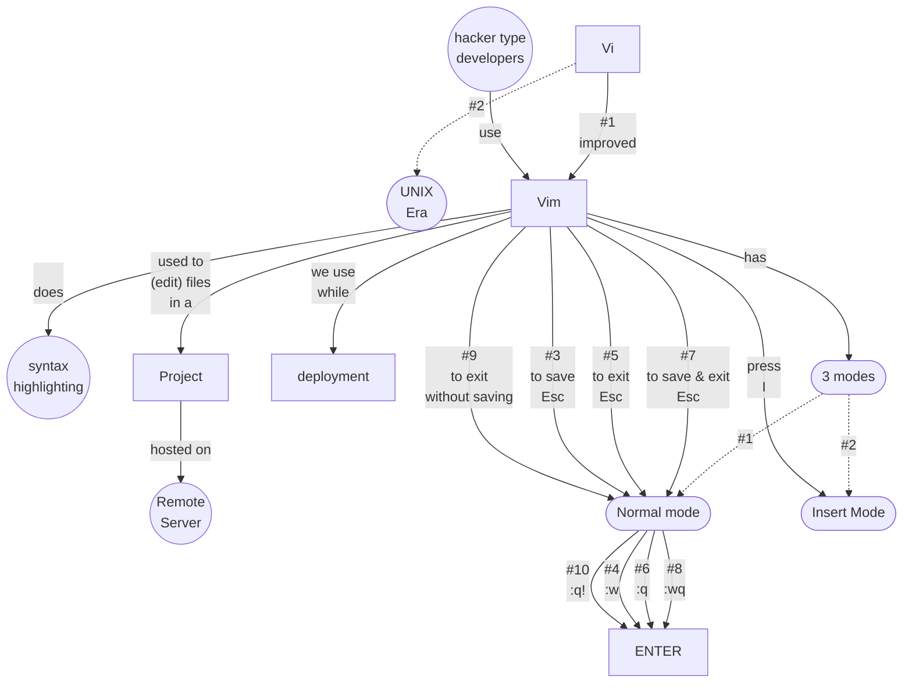

# Viewing and Editing files with Commands
- cat app.js
- cat test.sh
- nano app.js
- vim app.js
- vim -v
- vi -v

> `cat` means _concatenate_ (to read files)  
> if file is very large  
> it does't print in one go  
> it prints in small amount  
> and  
> goes concatenating  

## Vim & Nano
> there are not just `commands`  
> they are editors  

> `vim` or `vi`  
> _more powerful then VsCode_  
> `vim` made on top of `vi`

### Mac & Linux are based on UNIX
`nano` comes preinstalled with `bash`  