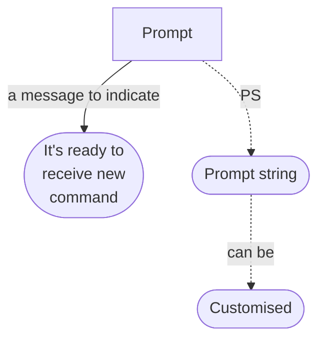
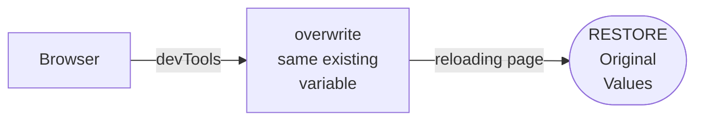

# What is Prompt in Terminal?

- echo $PS1
- echo $PS2
- echo $PS1
- PS1=YASH
- `Ctrl+L` many times
- echo $PS1
- `Close & open terminal`
- PS1="_________________"
- `but it's not permanent`
- echo $PS2
- "sdfj
- `>` abc"
- echo $PS2=Yash
- `❌`
- PS2=Yash
- "sdf
- `Yash`abc

> Array.prototype.filter=8  
> Array.prototype.filter  
> [6].filter()  
> `❌ Uncaught`  
> Reload and it'll reset values

> _to customize permanently -_  
> _we need to keep it somewhere_  
> _which runs (when terminal opens)_  
> **NEXT LECTURE**

### Similarly,
- there are _PS3_ & _PS4_
- _try_ to _see_