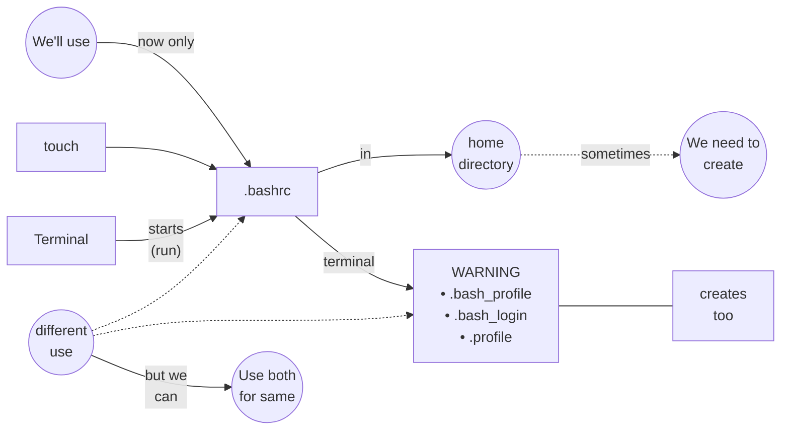

# Configuring our Terminal using .bashrc File

## Similarly,
`.bashrc`

- cd ~/
- explorer . `opens home directory`
- touch .bashrc  
`open .bashrc in VsCode`
> `paste:`  

<strong>.bashrc</strong>

    <pre style="display: inline-block; text-align: left; padding: 12px 20px;">num1=5
num2=4
echo $((num1+num2))
echo End</pre>

> `open new terminal`   
> `WARNING: Found ~/.bashrc but no ~/.bash_profile, ~/.bash_login or ~/.profile.`  
> `open new terminal`   

- echo $num2
- echo $num3
- echo $num36
> `paste:`  

<strong>.bashrc</strong>

    <pre style="display: inline-block; text-align: left; padding: 12px 20px;">num1=5
num2=4
num3=42
echo $((num1+num2))
echo End</pre>

> `open new terminal`  
- echo $num3
> `paste`  

<strong>.bashrc</strong>

    <pre style="display: inline-block; text-align: left; padding: 12px 20px;">echo running .bashrc</pre>

> `open new terminal`  
> `open .bash_profile in VsCode`  
> `paste`  

<strong>.bash_profile</strong>

    <pre style="display: inline-block; text-align: left; padding: 12px 20px;">echo running .bash_profile</pre>

> `open new terminal`  
> _you may think `.bashrc` runs earlier than `.bash_profile`_  
> _but it's not_  
> write the line `echo running .bash_profile` at the top in `.bash_profile`  

> `paste` in .bashrc

<strong>.bashrc</strong>

    <pre style="display: inline-block; text-align: left; padding: 12px 20px;">PS1="=> "</pre>

> `open new terminal`  
- echo $PS1
> copy value  

## ChatGPT
> `paste` PS1 value  
> Use ChatGPT to generate something beautiful prompt.  

> `open new terminal` is very irritating  
> alternatively we can use - `source ~/.bashrc` command  

- _use of `.bash_profile` is out of our scope_
- 2 types of shells
- `login shells` & `non-login shells`
