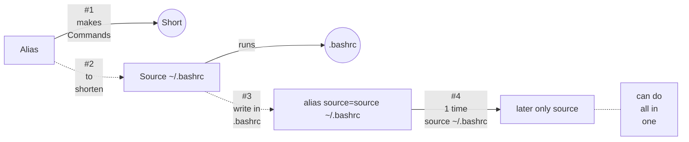

# Using Aliases for Command Shortcuts (alias)

```mermaid
flowchart LR

    A[Alias] -->|#1<br/>makes<br>Commands| S((Short))

    A -.-> |#2<br/>to<br/>shorten| SRC[Source ~/.bashrc]

    SRC -->|runs| BASHRC((.bashrc))

    CMD["alias source=source ~/.bashrc"]
    
    CMD -->|#4<br/>1 time<br>source ~/.bashrc| L["later only source"]

    SRC -.-> |#3<br/>write in<br>.bashrc| CMD

    L -.- CAN["can do<br/>all in<br/>one"]
```