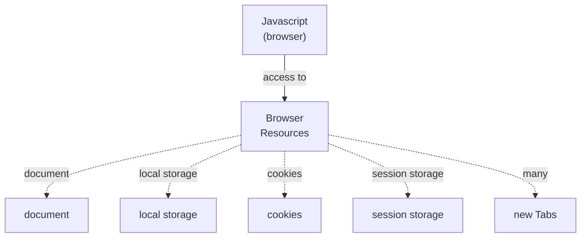
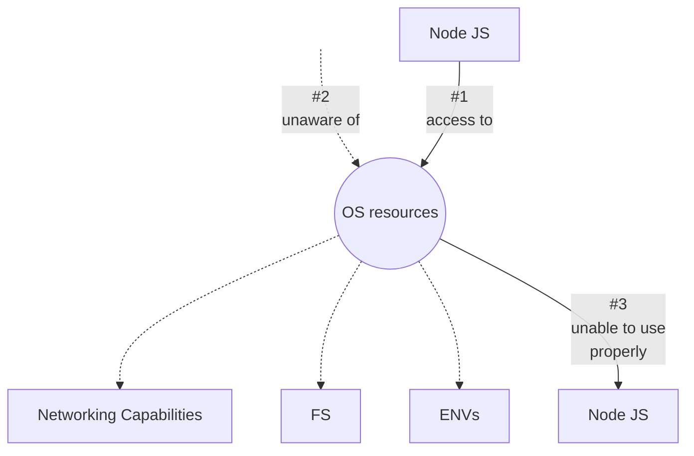
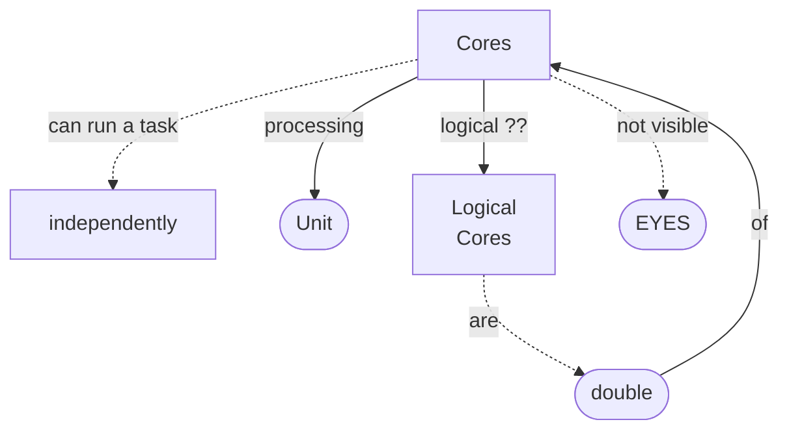

# Why OS?

  

  

  

> we'll not master OS  
> just OS basics  
> components & resources  
> not an `OS course`  

- example, if
- _physically:_ 4 Cores  
- modern technology (by processor manufacturers)
- 8 _logical cores_

> Task manager  
> ➜ Performance tab  
> _at bottom:_ cores, logical processors  
> In **Node REPL**  
> ➜ `os.availableParallelism()`  
  12  
> 12 different application (simultaneously)

