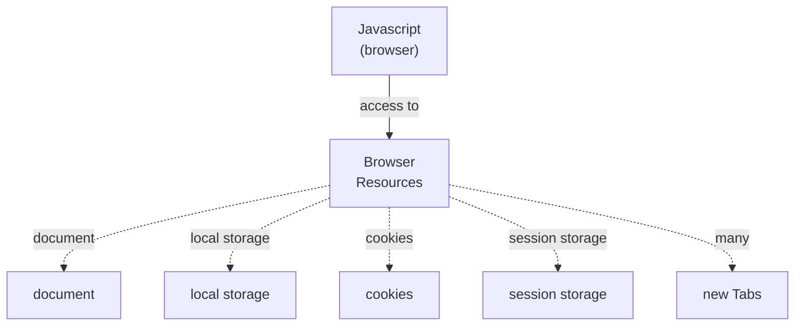
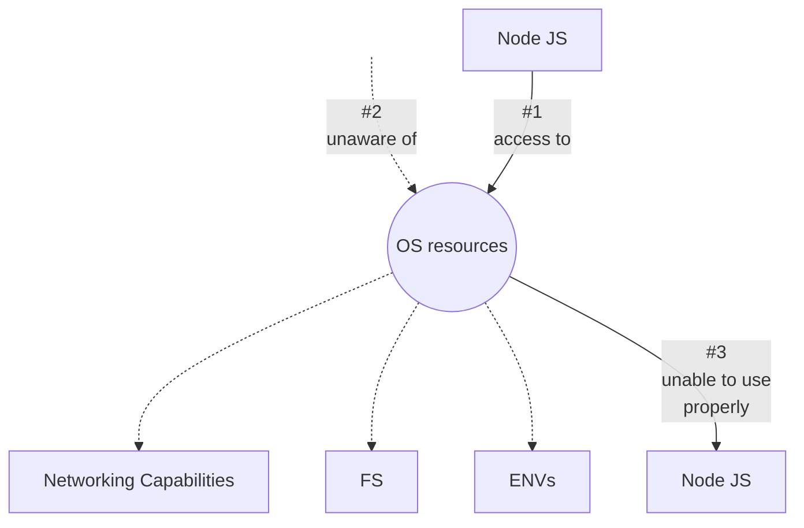
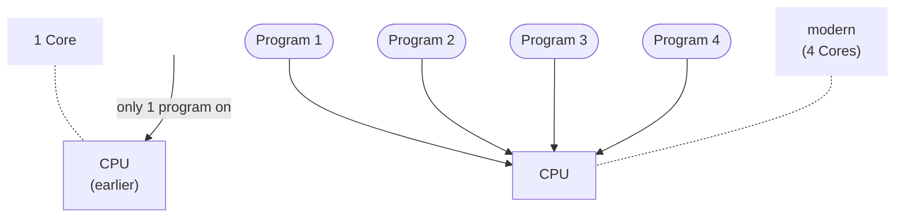

# Why OS?

  

  

  

> we'll not master OS  
> just OS basics  
> components & resources  
> not an `OS course` (Node.js course)  
> Imagine (picture)  
> CPU, Processor & Core  
> _In daily life we use the term `CPU` for the Cabinet_ but that's not true  
> CPU and Processor are same  
> fan for cooling on top of processor  
> CMOS (battery) for maintaining time, while system is off  
> `Anurag sir built their pc on 4 Nov, 2020`  

> in earlier days  
> CPU (single core)  
> only 1 program on 1 CPU at a time  
- example, if
- _physically:_ 4 Cores  
- modern technology (by processor manufacturers)
- 8 _logical cores_

### To see processor (specs, company), cores(physical, logical)
> Task manager  
> ➜ Performance tab  
> _top right:_  Processor name and some details  
> _at bottom:_ cores, logical processors  
> In **Node REPL** (_only_ logical cores can be seen)  
> ➜ `os.availableParallelism()`  
  12  
> 12 different application (simultaneously)  

`Anurag sir used the workspace (directory), he created for chapter-3 (Process), in VsCode, in this lecture to show os.availableParallelism()`