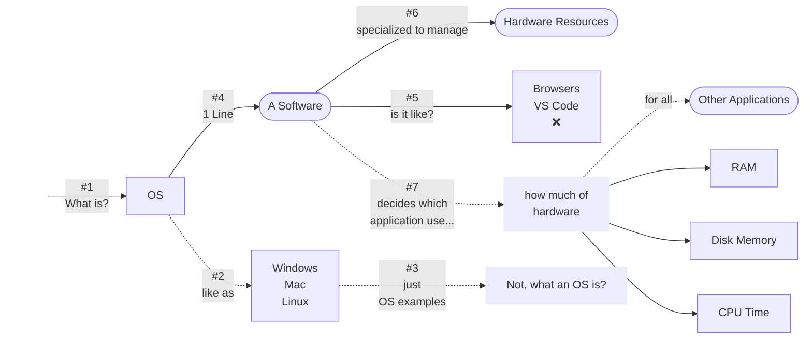
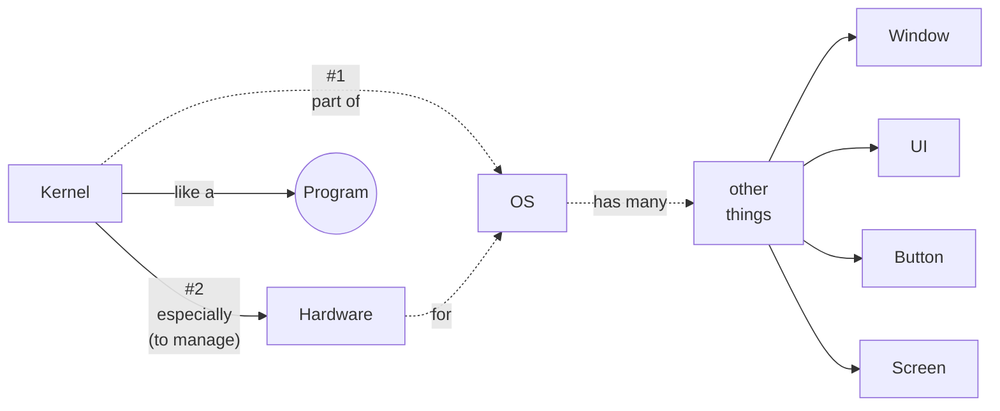
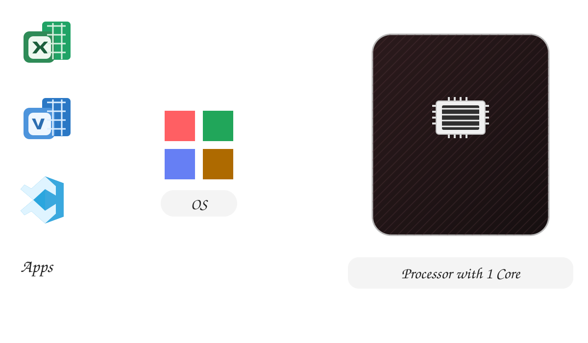
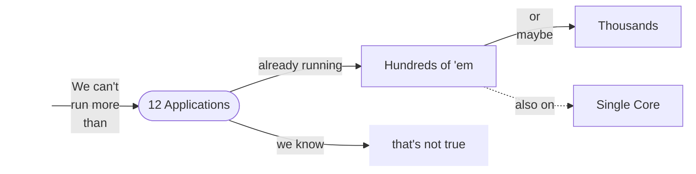
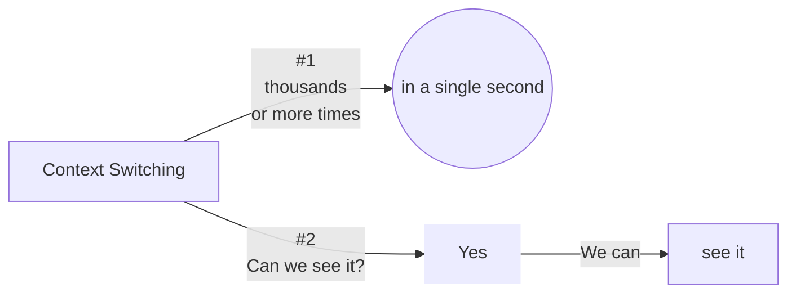

# What is OS and Kernel?

## Kernel

## Single Core
- does it mean
- 1 application at a time?
<!--  -->

  

  

> Task Manager ➜ Performance Tab  
> ➜ 6 Cores (physical)  
> ➜ 12 Cores (logical)  

> it's true (1 core CPU)  
> can run  
> only 1 application at a time  
> it's not true that (1 core CPU) can run  
> multiple applications at the same time  

- _think how it happens_ then,
- `Screen recording`
- `Excel`
- `VsCode`
- `Clock App`
- `background Applications`
- `browser`
+ MANY (in background)

> OS tells the applications to execute on CPU for a fraction (very small) each
  (in some repeated order)

> but

> this happens frequently

> so, at a time (instant)

> only 1 application (at a time) 

> does't mean 1 application (all the time)

> for dual core → two applications at an instant (time)

> doesn't mean only 2 apps all the time.

> _this whole stuff is called_ `Context Switching`  

### Next Video: Process